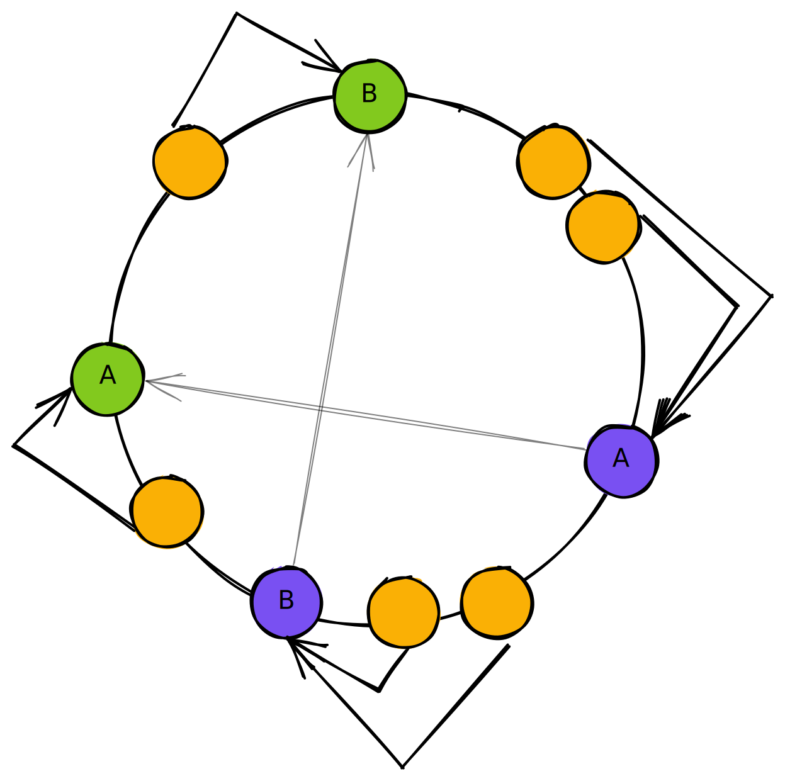

I stumbled upon a pretty interesting "balancing" concept, called
["Consistent Hashing"](https://en.wikipedia.org/wiki/Consistent_hashing). The rough premise is a way to distribute
things across a field (like servers, threads, continents, or you name it) — without rebalancing[^1] the members when
targets disappear.

[^1]:
    When you remove a target, all nodes needs to be rebalanced across the new set of servers. For example, caching
    across 5 servers evenly and removing 1 server now you need to _rebalance_ across 4 instead.

The thing that fascinates me is that it's purely a hashing function of the object, that then distributes around a ring,
"assigning it a degrees", and looking for the next server along that ring in a clockwise fashion, for where that data
should be.

If a server goes down, only the nodes before it are rebalanced, than the entire suite of nodes.

The implications of this is massive. Think of persistent connections and load balanced origins. If an origins goes
offline, only the connections connected to it are moved (obviously), but as soon as the origin comes back online, it
naturally balances back out, than having to remember which nodes was moved before. Or think of a content delivery
network, balancing content evenly amongst it's edges, as edges go offline and online, it minimizes data movement.

> 💡 It's not only about balancing, but also about minimizing data movement when a rebalancing occurs.

**What does it look like?**

- The orange circles are nodes
- The green circles are our targets or origins
- The purple circles are our phantoms nodes that point to real targets

### Nodes

Nodes are the elements or things we want to store, something hashable — ideally something you can deterministically
assign an angle or degrees to. The easiest way to achieve this is generate a hash number
([Murmur3](https://github.com/aappleby/smhasher/blob/master/src/MurmurHash3.cpp) can be good for this), and map that
between 0..360 as in zero would correspond to an angle of zero, and the maximum would correspond to 360 degrees.
Dispersing all other values linearly between them.

So what we do here is, we compute a hash of the node, and find where it lies around the edge of our ring.

### Targets and Phantoms

Targets are where our stuff is stored, or likely to be stored, and phantoms are pointers to those targets. Much like our
nodes, these targets and phantoms are also assigned an angle and placed around the ring.

**But why phantoms?**

Phantoms reduce the gap between targets around the ring. From the example above, you see that `A`, and `B` are quite far
apart, meaning that `A` would receive an overwhelming amount of nodes, than `B` would.

To combat this, you spin up a few more targets that point to real servers, and randomly place them around the ring as
well. Thus reducing the gap.

> You can assign a weight to each target, for how many phantoms it can produce — as a big machine might be able to
> handle more things.
