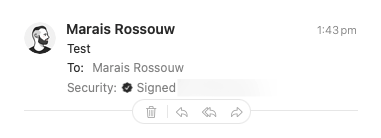
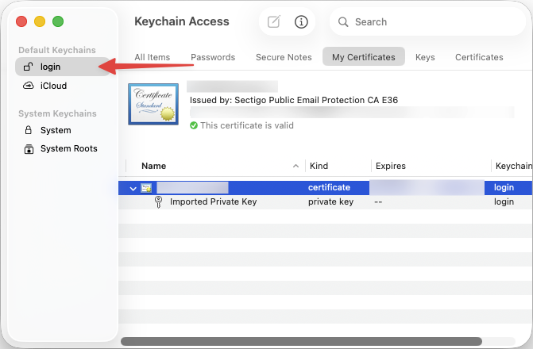

> Note: Even though I learnt this back in 2025, I only got around to writing it up now in 2026. I needed to renew the
> cert, and forgot how. So like if my past self wrote this, my future self (now current self) would have thanked me. lol
> rip.

For the [funnsies](https://www.urbandictionary.com/define.php?term=funnsies) I wanted to sign my email[^jane].

Email already has things like DKIM/SPF/DMARC, which help mail servers check that an email claiming to come from a domain
was actually sent through authorised mail servers and wasn't tampered with along the way.

S/MIME is the extra little nerd badge on top. It signs emails as me, so your mail client can show something like "this
sender has verified their email address".



## 1. Getting a cert

You need to get an S/MIME certificate from a CA (Certificate Authority). This was all new to me, see I grew up in the
era of free/automatic SSL certs. HTTPS is just something I don't really think about. I either use
[Let's Encrypt](https://letsencrypt.org), or get one from Cloudflare for free. So I was surprised to find out that
S/MIME certs aren't free and automatic. I had to buy one from a CA.

Thankfully, they're inexpensive.

They're available from pretty much any CA that sells SSL certs, like [Sectigo](https://www.sectigo.com/),
[DigiCert](https://www.digicert.com/), and so on. People usually prefer one CA over another for various reasons. I could
not quite figure out the differences, so I went with the cheapest one I could find at the time, since I just wanted to
try it out. Which was [SSLTrust](https://www.ssltrust.com/), they gave me a DigiCert signing cert for $27 AUD, and it
worked!

> Edit: I have since renewed with Sectigo, which was a bit more expensive. My employer (GitHub) uses Sectigo for their
> SSL certs, so I guess that gives me some confidence in them. I also had some issues with SSLTrust when I tried to
> renew. The portal is very confusing which made me switch to Sectigo.

## 2. Issuing it

Once I bought the "cert", you now need to issue it.

1. Generate a CSR (Certificate Signing Request) on your machine, and submit it to the provider.

   ```sh
   openssl ecparam -name prime256v1 -genkey -noout -out PRIVATEKEY.key
   openssl req -new -key PRIVATEKEY.key -out CSR.csr
   ```

When renewing the cert, you can use the same private key. Unless it's compromised, I cannot see a reason not to. But
make sure to securely back it up.

> Note: If none of the CSR details (like Country, Common Name, etc) has changed since you last issued, you can also skip
> this step entirely, and just reuse the same CSR.

2. Upload that CSR to the provider. Typically they'll send you a verification email, which usually takes about a minute.
3. Download the cert! 🎉

## 3. Bundling into a `.pfx`

What you get from the provider are usually two `.crt` files, the CA bundle (which links my cert back to the CA), and my
cert.

But to use it on your devices, you need a single file containing the private key, the cert, and the CA bundle. PKCS#12
is a standard format for bundling these together.

```shell
openssl pkcs12 -export \
  -out email.pfx \
  -inkey PRIVATEKEY.key \
  -in cert.crt \
  -certfile cert_ca_bundle.crt
```

> **Important:** give it an export password, iPhones require it.

## 4. Installing it

You'll need to install this `.pfx` file on every device you want to sign email on.

Since the `.pfx` file contains your private key, you should be careful about how you transfer it. And once you're done,
delete it. I keep mine stored in my password manager, so I can easily download it again if I need to install it on a new
device.

You could also just re-build the `.pfx` file from above when you need it again, but I find it easier to keep the `.pfx`
file around.

### Mac

It's as simple as double-clicking the `.pfx` file to add it to your keychain. You need to select the "login" keychain,
trying to add it to the "iCloud" keychain fails with a very unhelpful error message.



### iPhone

You need to get that `.pfx` file onto your phone somehow. I just AirDropped it to myself, but you could also upload it
to iCloud Drive and open it from there.

1. Open the `.pfx` file on your iPhone. It should prompt you to install it.
2. Navigate to Settings > General > VPN & Device Management, and under "Downloaded Profile" you should see the profile
   you just installed. Tap on it, and install the profile.
3. And finally, go to Settings > Mail > Accounts, select the email account you want to sign with. Find Security > Sign
   and Encryption, and turn on S/MIME > Sign.

[^jane]: Thank you Jane [for the idea](https://xcancel.com/wongmjane/status/1917474894910226547).
